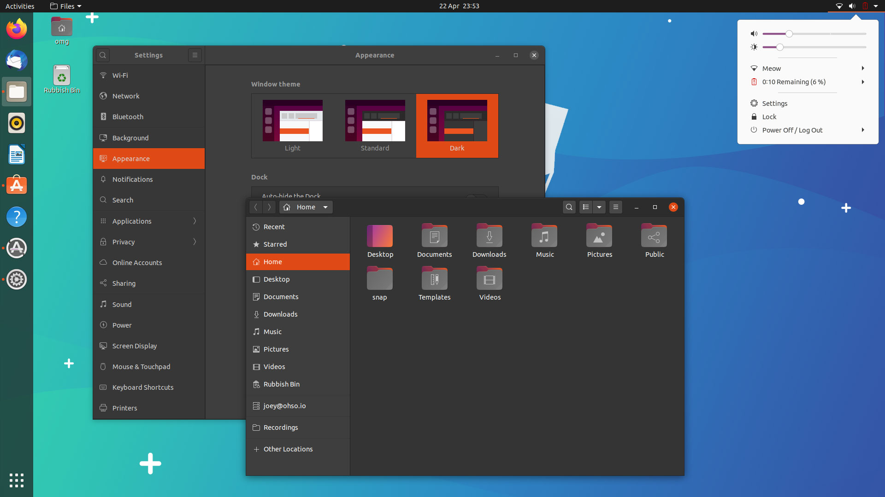
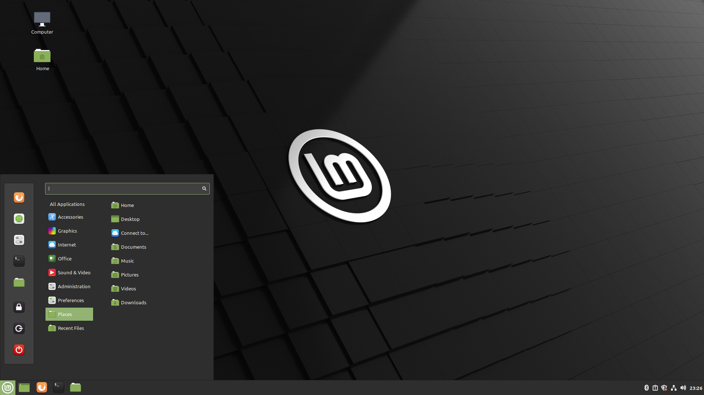

                   
For a beginner, getting into the world of linux can be a bit of a challenge. Linux is an open source operating system that is designed to do almost anything that any other OS like Windows or Mac can do.

Linux is open source! This means anyone can change, edit and redistribute its source code. This is why there are various different distributions of Linux that are available for someone to choose.

This blog will give you an idea about different distros that are available and which one you should choose as a beginner. Lets begin with looking at some of the big names that are available.

## 1. Ubuntu

Ubuntu is without a doubt the most talked about distribution among all others. It is a fork from the Debian project but has become a stand alone distribution with a large community support. Ubuntu has a fixed release cycle which means that new versions are launched at fixed intervals with a new version being released every 2 years. Ubuntu is a very stable distro and arguably one of the most user friendly distributions out there. As a beginner you can poke around tweaking its settings and there is very little chance that you will break the system. Ubuntu comes with the GNOME desktop environment by default but there are other flavours with KDE plasma, XFCE and LXQT desktop environments, it's really a matter of personal taste! Ubuntu would be a great choice to be your first linux install.

## 2. PopOS!

PopOS! Is another distribution that is based heavily on Ubuntu. It is specially customized for gaming. PopOS comes with graphics cards support for both Nvidia and AMD cards out of the box. While on ubuntu you might run into problems with installing the right drivers for your graphics card you will likely face no such problems with PopOS. On the downside however PopOs is really meant for Pcs with relatively high specs. You should have at least 8GB ram and at least a 2GB graphics card to enjoy the full capabilities of this distro. Other than that it is basically the same as Ubuntu. It comes with the GNOME desktop environment by default and currently that is the only version available. To change the desktop environment you would have to install the necessary packages on your own. If you have a high end PC you should prefer PopOs over Ubuntu as it will save you a lot of time in case you run into any issues with the graphics card.

## 3. Arch Linux

Ubuntu and PopOs work just fine out of the box! But Arch is completely different. Arch is a very minimal distribution that comes with only a few necessary packages. It does not even have a desktop environment to begin with. To install Arch you need to literally type commands into a terminal. One wrong command can wipe your hard disk and leave you without any hope of recovering what you lost if you do not have a backup. So Arch is not a beginner friendly distro. 
It is still on this list because it introduces you to a whole new side of linux. Arch is incredibly customizable and the user can control every aspect of how the system looks and works. Arch is a rolling release distro which means that new updates are made very rapidly. You can expect an update every day. This means that you will always have the latest technology right at your fingertips.
The downside to this is that rolling release makes Arch less stable than Ubuntu. However if you know how to Google you will probably be able to fix any problem as the community is amazing and the ArchWiki is a great resource to learn how the OS works. I would not recommend a beginner to install Arch on their PC but after getting familiar on Ubuntu you should try Arch at least once. Just the process of installing the distro will make you learn a lot about the Linux operating system and how computers work in general.

## 4. Manjaro

While Arch is not user friendly, Manjaro is a completely beginner friendly version on Arch. It comes with a Desktop environment just like Ubuntu and is really easy to install. The main difference is that unlike Ubuntu, Manjaro is a rolling release distro just like Arch. Manjaro is a great choice for someone trying to get into Arch but just wants to test the waters first. A beginner can use Manjaro just as easily as Ubuntu. Manjaro is also a lot more customizable out of the box. Manjaro with KDE desktop is the most popular choice among its users.

## 5. Linux Mint

Linux Mint is another great distro for beginners. It is easy to install and it comes with Cinnamon desktop which look a little like Windows XP so windows users will feel quiet at home. However under the hood Linux Mint is nothing like Windows. A great choice for a beginner but more seasoned users would likely prefer using another distribution. Still you can give it a try to see if it works for you.

So we have looked at five major distros that you should know about before choosing your first distribution. Which one you go with is completely up to you.

## A word of advice
------------
Do not stick with one distro for a long while, keep on trying a different distribution as it will increase your knowledge about linux and how it works. Try customizing your system and truly make it your own. Once you're done customizing would be able to feel the difference in your efficiency as compared to other operating systems. This is the real power of linux. Once you have installed linux on your machine it would be your first step to becoming a better, more efficient computer programmer.

