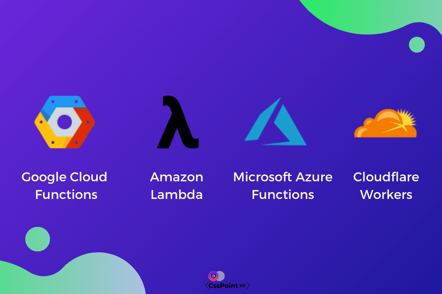

Developers spend countless hours solving business problems with code. Then it’s the ops team’s turn to spend countless hours, first figuring out how to get the code that developers write up and running on whatever computers are available, and second making sure those computers operate smoothly. The second part truly is a never-ending task. Why not leave that part to someone else?

## What is serverless computing?

Serverless computing is an execution model for the cloud in which a cloud provider dynamically allocates—and then charges the user for—only the compute resources and storage needed to execute a particular piece of code. Obviously servers are involved in the process but they are entirely mantained by the service provider.

Serverless functions are event-driven, meaning the code is invoked only when triggered by a request. The provider charges only for compute time used by that execution, rather than a flat monthly fee for maintaining a physical or virtual server. These functions can be connected together to create a processing pipeline, or they can serve as components of a larger application, interacting with other code running in containers or on conventional servers.

## Benefits

Developers can focus on the business goals of the code they write, rather than on infrastructural questions; and organizations only pay for the compute resources they actually use rather than on the whole infrastructure.

One of the canonical examples of a serverless architecture use case is a service that uploads and processes a series of individual image files and sends them along to another part of the application.

## Drawbacks

They are unsuitable for long-term tasks. Most serverless providers won’t let your code execute for more than a few minutes, and when you spin up a function, it doesn’t retain any stateful data from previously run instances. It may often become difficult to integrate serverless code into in-house development and testing pipelines.

## Serverless vendors

The modern age of serverless computing began with the launch of AWS Lambda, a platform based on Amazon’s cloud service, in 2014. Microsoft followed suit with Azure Functions in 2016. Google Cloud Functions, which had been in beta since 2017, finally reached production status in July 2018. The three services have slightly different limitations, advantages, supported languages, and ways of doing things.

Among all of the serverless computing platforms, AWS Lambda is the most prominent, and obviously has had the most time to evolve and mature. 