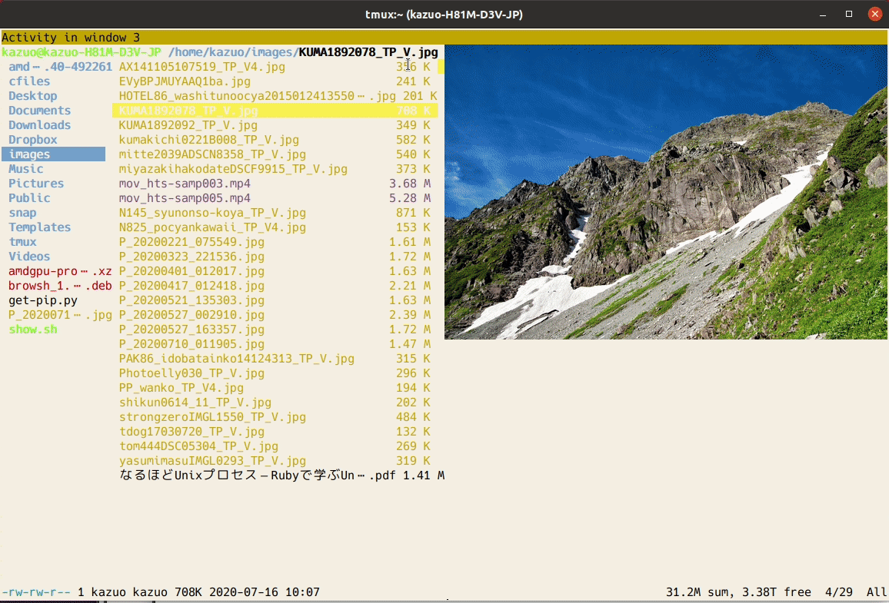
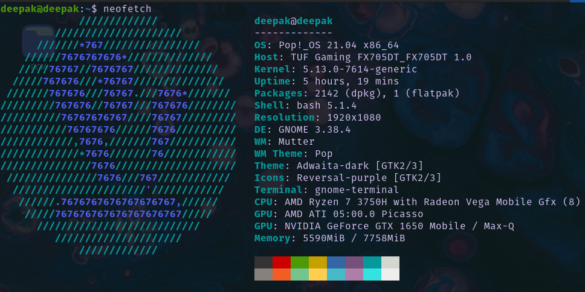
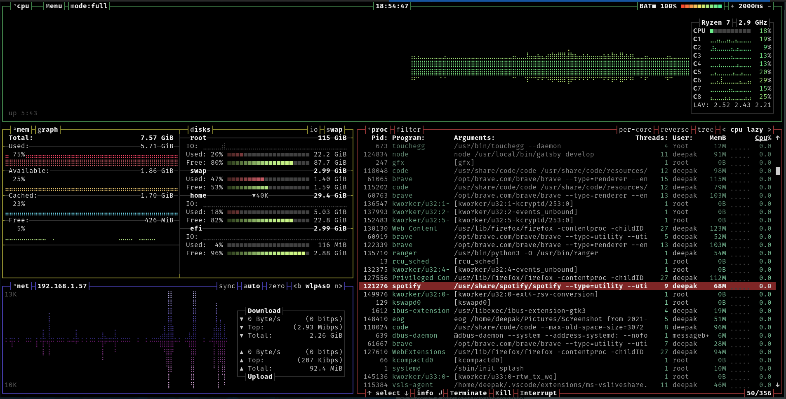
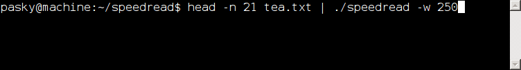
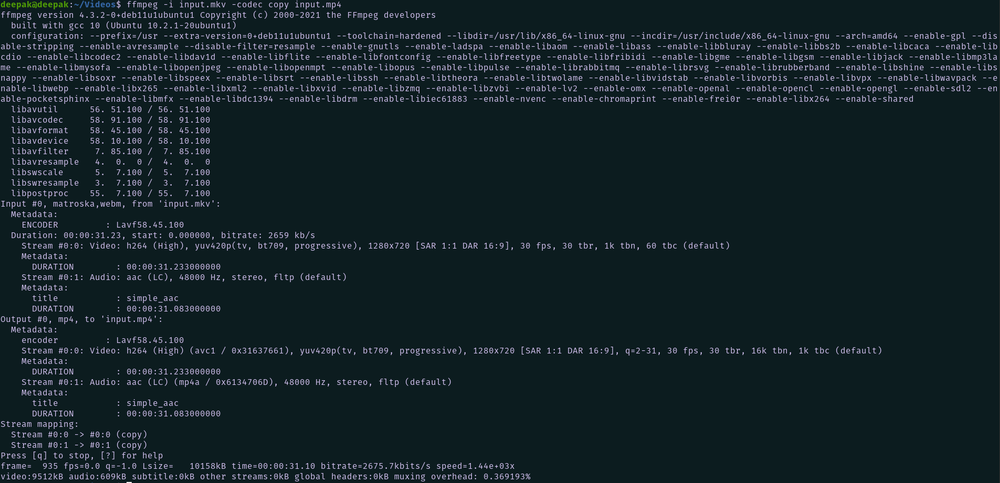

The Linux command line is a text-based computer interface, and It is also known as the shell, terminal, console, prompt, and a variety of other names, and it can be intimidating at first for beginners.
However, once you've grown accustomed to it, you'll realise how significant it is.
In Linux, the command line is exceptionally strong and quick.
You can make your experience even better by utilising some of the tools available; these tools will definitely make your life easier and your workflow more efficient.

## Ranger

 

*Ranger is open source vim-inspired file manager. With just a few arrow keys, you can navigate through a large number of files and preview images within the terminal. It is far faster than traditional file managers.*

You should definitely give it a shot!

For more information: [Click here!](https://github.com/ranger/ranger)

## Neofetch

*Neofetch is a system information command-line tool.Neofetch displays information about your operating system, applications, and hardware in a visually appealing manner.It comes pre-installed in the majority of Linux distributions. Neofetch can be further customised to display exactly what you desire.*

Fun-fact is that when you install any new linux distro you try to run neofetch first.

## Bpytop

*In its most basic form, Bpytop is a terminal-based task manager. You can inspect all background processes for any undesirable processes that are wasting your resources and terminate them.You can monitor your system's resource utilisation, such as CPU-fan speed, network speed, temperature etc.*

## Speedread

*If you want to read a document, speedread can be quite useful. It is, in essence, a tool that aids in the improvement of reading speed. You can also change the speed of the words per minute.*

## ffmpeg

*A video editor must have it! It is cross-platform audio and video recording, conversion, and streaming solution. It's quite useful when you need to compress videos without sacrificing quality.*

I used it to convert .mpv to .mp4 it took few milli-seconds.

*"Amazing fact about ffmpeg is that NASA also used it to compress and transcode data during Mars Mission."*

For more information: [Click here!](https://ffmpeg.org/)

## ImageMagick

*You definitely required to convert an image from one format to another, such as from.png to.jpeg. Most likely, you've used an internet browser tool. magick can do it in a split second. size, format, colours and maymore things are there in magick.* 

For more features: [Click here!](https://imagemagick.org/index.php)

## ascii-image-converter

*ascii-image-converter is a command-line tool that converts images into ascii art and prints them out onto the console. Available on Windows, Linux and macOS. It supports almost all image formats. Moreover it retains the formate during copy-paste unlike other online ascii-image converters.*

---

## Thank you!

There are thousands of command line tools available each better than other. Command line is really helpful and make working with computers so easy. 

*It just require some time to learn and some tools to know, now .............. you are ready to go!!*