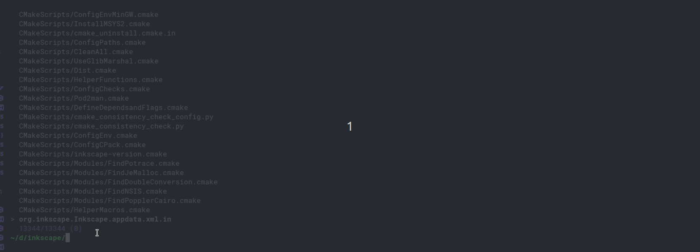
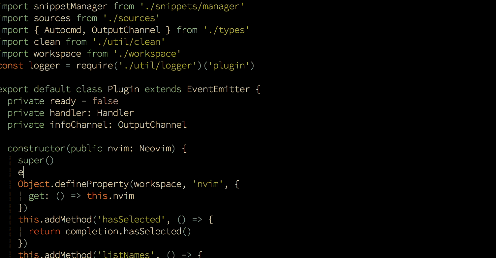

Vim is a great text editor, in fact some would argue it is the best text editor! But the problem is that it is just a text editor. Nothing more, nothing less.
People accustomed with using full fledged IDEs like Visual Studio, VS code, Atom etc. might feel hard to get started with vim. A great feature of vim is that it supports a large number of plugins that can increase its functionality in all the ways imaginable!
In this blog lets go over some of the plugins i use to make my life easier, hopefully you can pick up a few also.

## NERDTree

*“The NERDTree is a file system explorer for the Vim editor. Using this plugin, users can visually browse complex directory hierarchies, quickly open files for reading or editing, and perform basic file system operations.”*

A file tree is probably the most used feature of any modern code editor, including NERDtree makes file access much more efficient and easier. Jumping around files and making new folders becomes a matter of seconds.

## Vim-startify

*“This plugin provides a start screen for Vim and Neovim.”*

Vim-startify makes it very easy to open the recent files and also provides a cool programming tip! This is not a necessary plugin but for those who want to make vim feel just like VS code will love it.

## Vim-gitgutter

*“A Vim plugin which shows a git diff in the sign column. It shows which lines have been added, modified, or removed. You can also preview, stage, and undo individual hunks; and stage partial hunks. The plugin also provides a hunk text object.”*

If you work a lot on git repos then you will surely love this plugin.

## Vim-fugitive

*“Fugitive is the premier Vim plugin for Git. Or maybe it's the premier Git plugin for Vim? Either way, it's "so awesome, it should be illegal". That's why it's called Fugitive.”
This is a great plugin for regular git users and it really works like a charm. Run git commands right from within the vim environment. Stage files and resolve merge conflicts with ease. It makes using git version control very easy.*

## Fzf.vim

*“Things you can do with fzf and Vim.”*

This is a fuzzy search plugin for vim. It can search the file system for matching results and do that really quickly. There are other plugins like `CtrlP` but I have found Fzf to be much faster with larger repos.

## Gruvbox

This is probably the most used color scheme among vim users. It looks good and is easy on the eyes with different themes to choose from.

## Coc.nvim

*“True snippet and additional text editing support”*

And now the final and most important step in making vim work like an IDE. Coc is really a collection of plugins. You can download language support from the `coc-marketplace`. Setting up language support for c/c++ can be very confusing, but with coc.nvim u only just need to find the `clangd` in the marketplace and install it.

## AAAAAAAnd you are ready to go!
---

There are some other plugins like `vim-surround`, `indentline`, `lightline` and `nerdcommenter`. There are literally thousands of plugins you can try. It's really a matter of experimentation and trying to find what suits you the best.

You can visit [vimawesome.com](https://www.vimawesome.com) to discover new plugins and learn how to install and use them.
