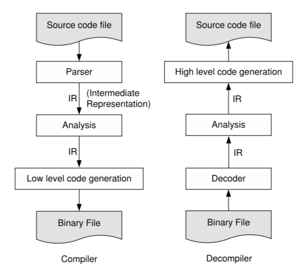

In computer programming, as in real life, names are useful handles for concrete entities. The key point about SSA is that having unique names for distinct entities reduces uncertainty and imprecision. 

For example, 
Consider overhearing a conversation about ‘Apple.’ Without any more contextual clues, you cannot disambiguate between the fruit Apple and Apple the American multinational technology company. 
As soon as the conversation mentions iPhone (rather than the fruit properties), you are fairly sure that the company Apple(rather than the fruit) is the subject. On the other hand, if everyone had a unique name, then there would be no possibility of confusing one of the largest brand on the planet with a fruit that grows in hilly areas. 

The **Static Single Assignment form(SSA)**, is a naming convention for storage locations(variables) in low-level representations of computer programs. The term static indicates that SSA relates to properties and analysis of program text (code). The terms in general refer to the uniqueness property of variable names that SSA imposes. As from the example above, this enables a greater degree of precision. The term assignment means variable definitions. 
Like, in the code
```
x=y+1;
```
the variable `x` is being assigned the value of expression `(y+1)`. This is a definition,or assignment statement, for `x`. A compiler engineer would interpret the above assignment statement to mean that the value of `x`(i.e., the memory location labeled as x) should be modified to store the value `(y+1)`.

## So what's SSA?

__A program is defined to be in SSA form if each variable is a target of exactly one assignment statement in the program text.__

However there are various, more specialized, varieties of SSA, which impose further constraints on programs. Such constraints may relate to graph-theoretic properties  of  variable  definitions  and  uses,  or  the  encapsulation  of  specific control-flow or data-flow information. Each distinct SSA variety has specific characteristics.
One important property that holds for all varieties of SSA, including the simplest definition above, is referential transparency. i.e., since there is only a single definition for each variable in the program text, a variable’s value is independent of its position in the program. We may refine our knowledge about a particular variable based on branching conditions, e.g. we know the value of `x` in the conditionally executed block following an if-statement that begins with 
```if(x==0)```
however the underlying value of `x` does not change at this `if` statement. Programs written in pure functional languages are referentially transparent. Such referentially transparent programs are more amenable to formal methods and mathematical reasoning, since the meaning of an expression depends only on the meaning of its sub-expressions and not on the order of evaluation or side effects of other expressions.

## History of SSA

Throughout the 1980s, as optimizing compiler technology became more mature, various **intermediate representations** (IRs) were proposed to encapsulate data dependence in a way that enabled fast and accurate data-flow analysis. The motivation behind the design of such IRs was the exposure of direct links between variable definitions and uses, known as def-use chains,enabling efficient propagation of data-flow information. Static single assignment form was one such IR, which was developed at IBM Research, and announced publicly in several research papers in the late 1980s. 
SSA rapidly acquired popularity due to its intuitive nature and straight-forward construction algorithm. The SSA property gives a standardized shape for variable def-use chains, which simplifies data-flow analysis techniques.Current Usage.The majority of current commercial and open-source compilers,including **GCC**, **LLVM**, the **HotSpot Java virtual machine**, and the **V8 JavaScript engine**, use SSA as a key intermediate representation for program analysis. As optimizations in SSA are fast and powerful, SSA is increasingly used in **just-in-time (JIT)** compilers that operate on a high-level target-independent program representation such as **Java byte-code**, **CLI byte-code** (.NET MSIL), or **LLVM bitcode**. Also High-level functional languages like **Julia/Python** etc. claim referential transparency as one of the cornerstones of their programming paradigm. Thus functional programming supports the SSA property implicitly.

## Benefits of SSA

### There are three major advantages to SSA:
- **Compile time benefit** : Certain compiler optimizations can be more efficient when operating on SSA programs, since referential transparency means that data-flow information can be associated directly with variables, rather than with variables at each program point. 
- **Compiler development benefit** : Program analyses and transformations can be easier to express in SSA. This means that compiler engineers can be more productive, in writing new compiler passes, and debugging existing passes.For example, the dead code elimination pass in GCC 4.x, which relies on an underlying SSA-based intermediate representation, takes only 40% as many lines of code as the equivalent pass in GCC 3.x, which does not use SSA.The SSA version of the pass is simpler, since it relies on the general-purpose,factored-out, data-flow propagation engine.
- **Program runtime benefit** : Conceptually, any analysis and optimization that can be done under SSA form can also be done identically out of SSA form.Because of the compiler development mentioned above, several compiler optimizations are shown to be more effective when operating on programs in SSA form. 


